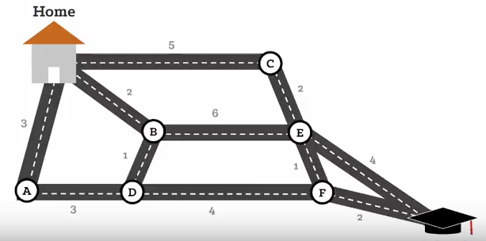
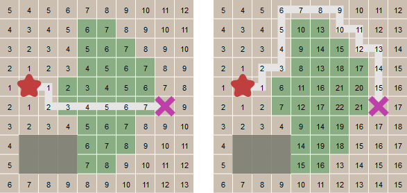

# word-ladder

Solutions to the Word Ladder Problem

## Why I Wrote this Code

This was a coding problem I picked out of a hat (from a selection of problems on the web). I did a pass at it a few years ago in C++, but didn't finish. I resurrected the problem as a Python coding exercise and decided to do a deep dive over a couple days. It was a good mind-sharpener for my current job search process.

The code here is my original creation. Other than some Googling on the basics of the algorithms, which I'd used in the past, this was my own work. Please respect my effort and credit me if you use this code.

## Overview

**Word Ladder Game:**

Find an algorithm to solve the word game where you have to go from one word to the other by changing only one letter at a time and using only words from the dictionary. For instance:


```
APE <-
APT
OPT
OAT
MAT
MAN <-

HEAD <-
HEAL
TEAL
TELL
TALL
TAIL <-

TOAD <-
LOAD
LEAD
HEAD
HEAT
FEAT      
FLAT
FLAG
FLOG
FROG <-
```

## Solutions



`Example of Connected Graph`

A dictionary of common (or uncommon!) three and four-letter words is processed into a connected graph. Each node in the graph represents a word and neighboring nodes contain words that are one letter-change away. `TOAD` and `LOAD` would be neighbors, while `TOAD` and `LEAD` would not.

To find a solution, an algorithm will explore the connected graph until it finds a path between the start word and the end word. Once it has a path, it will reduce the search space and try to find a more efficient path. The search ceases when the allowed search space has been exhausted.

I explore two different solution methods here:
* Depth-first search
* Breadth-first search


`The Two Approaches (standard CS 101 stuff)`

### Method 1 -- Depth-First: Recursive

This algorithm uses a recursive function to carry out the search. It also takes advantage of the dynamic programming concept known as "memoization", wherein optimal partial solutions are cached. The algorithm aggressively prunes out branches on the search tree that it determines to be useless to explore.


`Recursion!`

Performance is generally good, but there are cases where the algorithm can take minutes to crack a puzzle.

Run with:
> python WordLadderRecursive.py

Comments within the file explain the workings in more detail.

### Method 1 -- Breadth-First: A-Star

This algorithm uses the well-known A-Star route-finding heuristic to discover a path from the first node to the goal. Because it focuses on the nodes closest to the start node, before moving on to more distant ones, performance is pretty fast. 



`A-Star Illustrated: the green blocks are treated as obstacles in second panel`

Run with:
> python WordLadderAStar.py

Comments within the file explain the workings in more detail.

## Shared Code

Because both solutions rely on the same connected graph infrastructure, code for creating and examining this graph is shared. However, each method uses its own implementation of the Node class.

Both solutions also use the same test framework, which runs multiple instances of the game and collects statistics.

## Command Line Arguments

Both algorithms support command line arguments. Help can be accessed with:

> python WordLadderRecursive.py --help
>
> python WordLadderAStar.py --help

Argument | Description
---------|------------
`help` | Prints some help text.
`verbose` | Prints extra debugging information.
`seed` | A seed for random number generation. Use same seed for repeatable results.
`test` | Which test to run. 0 = basic test, 1 = full test, 2 = hard words test

## Sample Output

[Recursive Solution](SampleOutputRecursive.txt)

[A-Star Solution](SampleOutputAStar.txt)

